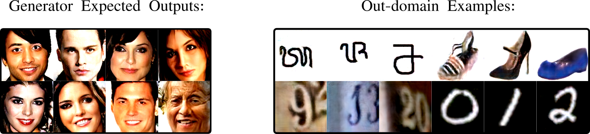

# Out-Domain Examples

Proof of concept and *TensorFlow* code for the paper: [Out-domain examples for generative models](https://arxiv.org/abs/1903.02926).

## Short abstract:

Test-time behavior of a generative model can be influenced by adversarial inputs.  An attacker can force a pre-trained generator to reproduce an arbitrary output if fed by a suitable latent representation. We call this output a **Out-Domain example**. 

Searching for out-domain examples *(ODE)* in the latent space of a [ProGAN](https://tfhub.dev/google/progan-128/1) trained on **CelebA**:

	

## Code:

All the code is available in the package *./ODE*   [tensorflow_1.8  is recommended]

#### Examples:

Some examples are available in  *./Examples/\**

* **DCGAN_SVHN"**  *ODE* generation process for a pre-trained *DCGAN* generator trained on *SVHN* (with *tensorboard* logging).

---
How to cite our works:
> @INPROCEEDINGS{8802456, 
author={D. {Pasquini} and M. {Mingione} and M. {Bernaschi}}, 
booktitle={2019 IEEE European Symposium on Security and Privacy Workshops (EuroS PW)}, 
title={Adversarial Out-domain Examples for Generative Models},  
year={2019},   
pages={272-280}, 
}
